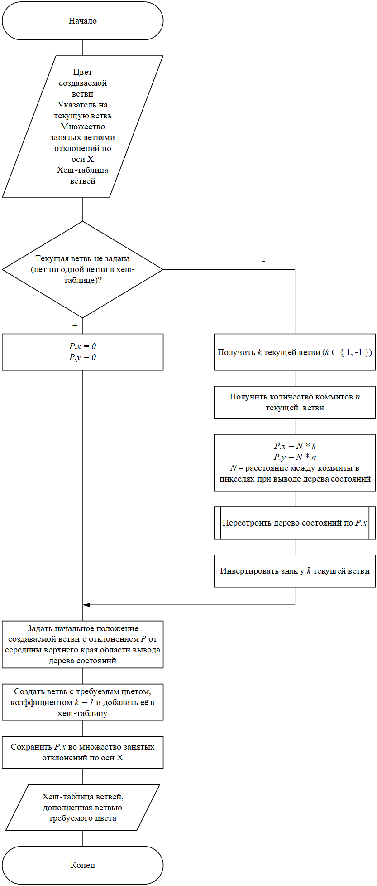

# Game Engine
---

## Краткое описание

Данный репозиторий содержит решение (solution) Microsoft Visual Studio 2022, выполняющее две роли:

<ol>
	<li>Адаптор-обёртка для DirectX (Direct2D/DirectWrite) и WinAPI</li>
	<li>Небольшая библиотека классов, реализующая базовые аспекты игр</li>
</ol>

Текущий проект написан на C++ с использованием, преимущественно, стандарта 20-го года и преследует исключительно учебные цели. Тем не менее, он является вполне самостоятельным и функционирующим игровым 2D-движком, что, в частности, доказывается примерами:

<ol>
	<li>Arkanoid - вариант известной игры с разбиванием блоков шариком</li>
	<li>Starfield - простое приложение с случайно генерируемым звёздным полем и управляемой камерой</li>
	<li>PaintItGit - пошаговое закрашивание блоков с версионным контролем</li>
</ol>

### Функционал

Здесь можно найти реализацию:
- окон на WinAPI (класс `GameEngine::MainWindow` в проекте MainWindow) с отслеживанием нажатых клавиш и положения курсора на экране
- матриц (класс `GameEngine::Geometry::Matrices::Matrix` в проекте GameEngine), способных вычисляться во время компиляции
- основных аффинных преобразований с использованием матриц
- математического вектора (класс `GameEngine::Geometry::Vector2D` в проекте GameEngine) для двумерного пространства
- игрового 3-х этапного (Proccess Input -> Update -> Render) игрового цикла (класс `GameEngine::Game`)
- механизма синхронизации скорости генерации кадров и обновления состояния игры (класс `GameEngine::FrameTimer` в проекте GameEngine)
- отрисовки графических примитивов, текста, битмап с возможностью задания "прозрачных" пикселей (класс `GameEngine::GraphicsDirect2D` в проекте GameEngine)
- автоматического выделения и освобождения ресурсов, предоставляемых Direct2D (класс `GameEngine::Direct2DFactory` в проекте GameEngine)
- исключений для обработки ошибок в WinAPI (класс `GameEngine::WinApiException` в проекте GameEngine) и Direct2D (класс `GameEngine::Direct2dException` в проекте GameEngine)

### Установка и внедрение в другие проекты

Если установлен Microsoft Visual Studio 2022, то достаточно скачать содержимое репозитория и открыть файл решения GameEngine.sln
При этом необязательные проекты: Matrices, Arkanoid, PaintItGit, Starfield, MainWindow. Все перечисленные подпроекты являются зависимыми от проекта GameEngine и включены в общее решение, поэтому отдельно их собрать не получится.

Затем, чтобы получить исполняемый файл, нужно нажать "Сборка"->"Собрать решение", после чего можно будет запустить либо одно из представленных приложений в репозитории, либо сам игровой движок (будет черное окно).

Все файлы представляют собой исходный код, связанный между собой директивой препроцессора `#include`, поэтому их можно свобдно использовать в других программах при условии соблюдения `#include` зависимостей.


### Примеры использования

Строго говоря, присутсвующие в решении проекты сами по себе являются примерами использования данного игрового движка. Однако для быстрого ознакомления стоит коснуться базовых аспектов работы с компонентами репозитория и дать некоторые комментарии к типовому коду.

После клонирования репозитория можно удалить все проекты, кроме GameEngine и MainWindow. Чтобы не нарушать пути в директивах `#include` между компонентами можно в рамках решения GameEngine создать новый проект Windows-приложения и добавить в него (ПКМ по фильтру "Исходные файлы"->"Добавить"->"Существующий элемент...") все .cpp файлы (или по мере надобности). Репозиторий не являются библиотекой шаблонов, хотя некоторые компоненты действительно описаны в шаблонах, поэтому компиляция необходима.

Итак, чтобы создать свою игру следует наследовать класс `GameEngine::Game`, например:

```C++
class TestGame : public GameEngine::Game
{
public:

	TestGame(GameEngine::Interfaces::IWindow& window, GameEngine::Interfaces::IFramableGraphics2D& graphics)
	:
	Game{ window, graphics }
	{ }
}
```

Для интерфейса `GameEngine::Interfaces::IWindow` в проекте MainWindow предусмотрена простая реализация `GameEngine::MainWindow`, а для `GameEngine::Interfaces::IFramableGraphics2D` можно взять `GameEngine::GraphicsDirect2D`. В итоге, инциализация объекта класса `TestGame` может выглядеть так:

```C++
int WINAPI WinMain(_In_ HINSTANCE hInstance, _In_opt_ HINSTANCE, _In_ LPSTR lpCmdLine, _In_ int nCmdShow)
{
    GameEngine::MainWindow m_wnd{ hInstance, nCmdShow, L"Test App" };
    GameEngine::GraphicsDirect2D graphics{ m_wnd.get_window_handler() };
    TestGame theGame{ m_wnd, graphics };
    theGame.start();

    return EXIT_SUCCESS;
}
```

В результате будет отображено чёрное окно. 

Вся логика игры заключена в 3-х методах класса `GameEngine::Game`:

- `virtual void process()` - этот метод предназначен для обработки очереди сообщений. В общем случае, его можно не переопределять
- `virtual void update()`  - переопределение этого метода должно содержать логику изменения состояния игры
- `virtual void render()`  - отрисовка мира и моделей

В методе `update` следует располагать всю логику обработки и изменения мира (состояния игры), а отрисовку (вывод на окно) - в методе `render`. Метод `process` в общем случае переопределять не нужно, однако если используется свой обработчик событий окна, клавиатуры мыши и т.д., то рекомендуются следующий подход:

```C++
void TestGame::process()
{
	Game::process();
	// остальной код...
}
```

Вызов метода `GameEngine::Game::start` запускает бесконечный игровой цикл, который будет завершен автоматически при закрытии окна или вызова метода `GameEngine::Game::stop`. Более подробные примеры использования игрового движка представлены в проектах Arkanoid, PaintItGit, StarField.

## О приложениях, демонстрирующих данный игровой движок

В этом разделе приведено краткое описание приложений, цель которых заключается в демонстрации того, что можно сделать с использованием текущего игрового движка. Разумеется, поскольку сама концепция предлагаемого фреймворка, или, вернее сказать, адаптора для Direct2D/DirectWrite, заключается в формировании "обёртки" для системных объектов и библиотеки базовых компонентов, то и предалагаемые в репозитории примеры не отражают ограничения по созданию программ. Однако они могут быть полезны как варианты организации различных механизмов и функций. Вдобавок, многие классы могут быть взяты и использованы в других проектах, что, соотвтетсвенно, раскрывается в коде приведённых приложений.

### Arkanoid

Приложение представляет собой простой вариант известной одноименной игры. Цель состоит в том, чтобы набрать как можно больше очков за уничтожение блоков шариком. Количество получаемых очков увеличивается с количеством разрушенных блоков подряд (без столкновения шарика с платформой). При этом после каждого разрушения блока появляется ракета, летящая в сторону платформы. Эти ракеты могут быть уничтожены шариком, что приведет к взрыву, отбрасывающим шарик. При чем возможна цепная реакция: взрыв ракеты задевает другую ракету, что уничтожает другую, и так по цепочке. Игра завершается либо когда заканчиваются жизни, либо когда уничтожены все блоки. Каждый пропущенный до нижней границы шарик, то есть шарик, который ударяется о нижнюю стенку поля, снимает 1 жизнь. Также 1 жизнь снимается при попадании ракеты по платформе. Управление платформой производится с помощью клавиш-стрелок "влево" и "вправо", при чём скорость и длина платформы фиксированы. Скорость шарика увеличивается только при попадании по ракете и сбрасывается после потери жизни игроком.


С программной точки зрения, здесь продемонстрирована работа со спрайтами (ракета, пиктограмма жизней), графическими примитивами (блоки, шарик, платформа), простыми 2D преобразованиями (отскок шарика, равноускоренное движение, проверка коллизий), текстом (вывод количества очков, надписей).

### StarField

Приложение отрисовывает простое чёрное поле с разноцветными пульсирующими и вращающимися звездами разных размеров и форм. По нему можно двигаться с помощью камеры: стрелочки осуществляют движение, клавиша Q - поворот против часовой стрелки, E - поворот по часовой стрелке, Z - приближение, X - отдаление.


Этот проект примечателен тем, что демонстрирует работу аффинных преобразований в матричной форме.

### PaintItGit

Приложение является реализацией оригинальной идеи, заключающейся в воплощении принципов системы контроля версий в игровой форме. Поскольку этот проект наиболее оригинален из всех представленных здесь, то ниже приведено более подробное описание.


# Описание проекта PaintItGit
---

## Концепция игры

Существует идея для программного продукта, позволяющая в игровой форме представить основные принципы работы с системами контроля версий, или состояний. 

Пусть дана некоторая область, разбитая на N равных блоков и не имеющая свободного пространства. Каждый из этих блоков случайным образом окрашен в один из M цветов. Цель игры состоит в том, чтобы сделать всю область одного цвета.

Для достижения цели игрок может, во-первых, окрашивать блоки одним из M цветов на выбор, двигаясь от текущего блока либо налево, либо направо, либо вверх, либо вниз. Нельзя закрашивать блоки тем же цветом, что и он сам. Нельзя выйти за границы области. Пусть текущим является последний закрашенный блок. Первоначально текущий блок не задан, поэтому игрок первый закрашиваемый блок выбирает произвольно. 

Во-вторых, по мере закрашивания области формируется дерево, визуализирующее систему состояний игры. Каждая ветвь имеет один из M цветов. Цвет присваивается в момент создания ветви, после он не может быть изменён. Ветвь создается каждый раз, когда новый текущий блок отличается по цвету от предыдущего текущего блока, и ей присваивается цвет нового текущего блока. Одновременно не может быть несколько ветвей с одним и тем же цветом (следовательно, одновременно может быть не более M ветвей). Поскольку дерево – это представление системы состояний игры, то оно должно поддерживать базовые операции системы контроля версий, в том числе и слияние, или объединение (с англ. «merge») ветвей, что обеспечивает второй способ закрашивания блоков.

Таким образом, игровой процесс заключается во взаимодействии с областью и системой контроля состояний. Требуется разработать программный продукт под названием «Paint It Git», реализующий описанную концепцию.

Система контроля версий, или состояний, – это система, записывающая изменения в файл или набор файлов в течение времени и позволяющая вернуться позже к определённой версии. Согласно концепции программного продукта, данный компонент должен быть непосредственно включен в игровой процесс. 

Так, необходимо, чтобы факт окрашивания блока сохранялся, и можно было вернуться к моменту до изменения цвета. При этом, последовательность окрашиваний должна создавать своеобразную цепочку, или ветвь соответствующего цвета. Соответственно, система контроля состояний приложения должна фиксировать изменение цвета в момент окрашивания блока, а также позволять по запросу пользователя загружать сохраненные состояния.

Особое значение уделено так называемым «ветвям». В данном случае ветвь – это отдельная, то есть независящая от действий пользователя в других ветвях, последовательность состояний игрового поля. Другими словами, ветвь – это версия игрового поля, в рамках которой происходят изменения. Ветви можно создавать, объединять, выгружать, а также удалять. Эти операции являются базовыми, например, в Git – одной из самых популярных систем контроля версий, поддерживающих древовидное представление. Поэтому их наличие не только углубляет игровой процесс, но и способствует более точной визуализации работы с типовыми системами контроля версий.

Принцип операции создания ветвей описан в концепции приложения, здесь же следует уточнить, что все ветви кроме первой являются дочерними, то есть любая ветвь кроме первой должна исходить из состояния, принадлежащего другой ветви.

Операция объединения/слияния ветвей, как было отмечено ранее, является вторым способом окрашивания блоков. Поскольку её суть заключается в переносе состояний (цветов блоков) из одной ветви в другую, в результате чего игровое поле меняется, и открываются новые возможные ходы для игрока.

Ветви можно выгружать – заменять состояния одной ветви на состояния другой. Аналогично можно переключаться в любое состояние любой ветви. В соответствии с концепцией, если игровое поле находится не в последнем состоянии ветви, то игрок не может закрашивать блоки цветом ветви, ведь это приведет к неопределенной ситуации. Однако он может закрасить блок другим цветом (если соответствующей ветви в данный момент не существует) и таким образом создать новую ветвь и выгрузить её.

Кроме этих операций необходимо определить и удаление ветвей. Ведь отсутствие такой возможности не только приведёт к очевидной ограниченности игровых возможностей, но и сделает недостаточно полным отражение опыта работы со системами контроля версий. При удалении одной ветви должны удаляться и все дочерние ветви.

## Макет пользовательского интерфейса


<p align="center">Макет пользовательского интерфейса программного продукта</p>
<br/>

Под цифрой «1» обозначена игровая область, разбитая на равные цветные квадраты (сетка отображена на макете только для демонстрации этого факта, в итоговом интерфейсе она не нужна), соответствующие блокам в концепции программного продукта. Пользователь может закрашивать квадраты, кликая по ним. При этом доступные для закрашивания квадраты следует анимировать. Игра не должна реагировать на попытки закрасить недоступный блок.

Под курсором в виде миниатюрного квадрата (цифра «3» на рисунке выше) обозначается текущий цвет закрашивания, который можно менять либо с помощью мыши, либо с помощью клавиатуры. Соответственно, при смене цвета автоматически должна перекрашиваться миниатюра под курсором, а также обновляться доступные для закраски блоки.

В прямоугольнике под цифрой «2» отображена система контроля состояний игры. Здесь кружки – это состояния игры, при чём закрашенный – это текущее, или активное состояние. Цвет соединительных линий и контуров кружков соответствуют цвету ветви, которой принадлежат. Само дерево растёт вниз, а ветви всегда параллельны оси Y. Ветви не должны накладываться друг на друга. Желательно предоставить игроку возможность двигать дерево в рамках заданной области (обозначена цифрой «2» на рисунке выше).


<p align="center">Функционал приложения</p>
<br/>

## Модель системы контроля состояний

Принято решение хранить данные как набор изменений, или дельт, относительно первоначальной версии объекта. В данном случае, под объектом понимается игровая область, разделенная на блоки, а изменение – это закрашивание некоторого блока определённым цветом. По возможности, сущности модели повторяют аналогичные элементы Git. Например, каждое изменение описывается коммитом, который обязательно включен в какую-либо из ветвей. Это также позволяет более точно отразить логику самой популярной системы контроля состояний.

Для каждой дельты необходимо хранить три значения: указатель на блок, новый и старый (до окрашивания) цвета. Старый цвет добавлен из соображений упрощения отката изменений, то есть вместо того, чтобы последовательно применять дельты до нужного момента, достаточно двигаясь от текущего состояния до нужного заменять текущий цвет блока на старый. Эти данные составляют неотъемлемые поля коммита. Блоку же с точки зрения системы контроля состояний достаточно хранить свой текущий цвет.


<p align="center">Концептуальная схема коммита</p>
<br/>

Поскольку согласно концепции игры коммиты формируются исключительно последовательно и без возможности удаления или создания в произвольном порядке, то их необязательно связывать в список. Следовательно, как минимум, без потери эффективности можно использовать динамический массив. Это обеспечит, во-первых, константную асимптотическую сложность доступа к каждому из коммитов, во-вторых, уменьшит расходы памяти из-за отсутствия указателей, в-третьих, позволит использовать бинарный поиск, в-четвёртых, позволит использовать «нативную» идентификацию. Под последним подразумевается использование индексов массива как идентификаторов коммитов. Чтобы обеспечить такой механизм, следует помещать массив коммитов в ветви. В случаях объединения ветвей копирование коммитов неизбежно (как показано ранее при описании Subversion), но поскольку они будут добавляться в конец массива как новые элементы, то будет происходить автоматическая переиндексация.

Каждая ветвь помимо массива коммитов должна хранить цвет, идентифицирующий её. Таким образом, упрощённая схема ветви приведена на рисунке ниже. Стоит отметить, что хоть в общем случае разные коммиты указывают на разные блоки, но после объединения ветвей может оказаться так, что некоторые коммиты указывают на одни и те же блоки.


<p align="center">Концептуальная схема ветви</p>
<br/>

Однако в такой модели не отражено, как будет храниться факт наследования ветвей и слияния. Это нужно, во-первых, для корректного отображения дерева состояний и, во-вторых, для реализации переключения состояний из разных ветвей. Одним из вариантом решения такой задачи может быть подход, реализованный в Git, то есть использование перемещаемых указателей. Но в данном случае есть обстоятельство, говорящее не в пользу данного метода, а именно: игроку необходимо будет для достижения цели часто создавать, удалять, сливать ветви, а также переключаться между ними. Всё это требует поиска нужной ветви. Если принять положение, что цвет кодируется как 32-битное беззнаковое число по модели RGBA, и присовокупить к этому идентифицирующее ветвь свойство цвета, то получается готовый и тривиальный ключ для хеш-таблиц.

Иными словами, все ветви будут храниться в одной хеш-таблице, где ключом является закодированное значение цвета.


<p align="center">Концептуальная схема метода хранения ветвей</p>
<br/>

Таким образом можно обеспечить константную асимптотическую сложность поиска нужной ветви. Но отказ от указателей и необходимость хранения фактов наследования и слияния требуют несколько усложнить модель ветви и ввести два новых поля: предки ветви и слияния (с какой ветвью была слита текущая). Оба являются динамическими массивами. Первый хранит экземпляры структуры с полями: цвет ветви, номер коммита. Второй – структуры с полями: номер коммита (на котором текущая ветвь была слита), цвет ветви (с которой слита текущая), номер коммита (в который была слита текущая ветвь).


<p align="center">Схема ветвей с учётом хранения связей с другими ветвями</p>
<br/>

Такое решение продиктовано упрощением процедур удаления и переключения ветвей. Поскольку каждая ветвь хранит всех своих предков, то при удалении любой ветви достаточно просмотреть остальные и удалить те, у которых удаляемая ветвь – предок. Аналогичная оптимизация касается и переключения ветвей, требующей применения и отмены дельт (коммитов).

Кроме хеш-таблицы разрабатываемая система контроля состояний обязана хранить информацию о том, какая ветвь является текущей (указатель на ветвь в хеш-таблице) и в каком состоянии находится программный продукт («голова», или номер последнего коммита текущей ветви). 

Система контроля состояний как компонент разрабатываемого программного продукта реализует интерфейс, состоящий из следующих функций:
1. `commit` («зафиксировать изменения»). На вход принимаются указатель на блок и цвет, в который этот блок перекрашивается. На выход ничего не подаётся.
2. `branch` («создать ветвь»). На вход принимается цвет создаваемой ветви. На выход ничего не подаётся;
3. `checkout` («переключить ветвь»). На вход принимается цвет ветви, которую нужно выгрузить. На выход подаётся ссылка на блок, который является текущим в рамках ветви.
4. `rollback` («перейти в предыдущее состояние»). Ничего не принимается на вход. На выход подаётся ссылка на блок, который является текущим в состоянии.
5. `rollforward` («перейти в следующее состояние»). Ничего не принимается на вход. На выход подаётся ссылка на блок, который является текущим в состоянии.
6. `merge` («слить ветвь»). На вход принимается цвет ветви, которую нужно слить с текущей. На выход подаётся ссылка на блок, который является текущим в состоянии.
7. `delete_branch` («удалить ветвь»). На вход принимается цвет ветви, которую нужно удалить. На выход подаются цвет новой текущей ветви и ссылка на блок, который является текущим в состоянии.
8. `move_to` («перейти в состояние»). На вход принимается точка в экранных координатах. На выход подаются цвет новой текущей ветви и ссылка на блок, который является текущим в состоянии.

Здесь представлены только необходимые операции модели системы контроля состояний. Так, конечная реализация значительно сложнее. В частности, требуется отображать дерево на экране, что приводит к расширению структур ветвей и введению новых функций. Некоторые наиболее важные аспекты будут раскрыты в дальнейшем. 

Однако последним вопросом, который целесообразно раскрыть в данном пункте, является то, как сохранять систему контроля состояний. Для этого достаточно в момент закрытия программы переносить все необходимые для последующего точного восстановления данные в файл.


<p align="center">Структура файла сохранения системы контроля состояний программного продукта</p>
<br/>

## Алгоритмы системы контроля состояний

В рамках данной работы следует уделить особое внимание следующим операциям и спроектировать для них алгоритмы:
- создание ветвей (функция `branch` из описанной ранее модели);
- слияние ветвей (функция `merge` из описанной ранее модели).

Стоить отметить, что с целью упрощения отрисовки дерева состояний, в структуре ветви хранится ещё и массив с экранными координатами для коммитов. Эти координаты задаются при создании коммитов и меняются, когда пользователь сдвигает дерево состояний при помощи мыши.

### Алгоритм создания ветвей

При создании ветвей важно помнить, что её необходимо не только хранить в памяти, но и отображать в интерфейсе программного продукта как часть дерева состояний. Ранее было отмечено, что каждая ветвь параллельна оси Y, но должна находиться в рамках определённой области на некотором расстоянии по оси X от других ветвей, поскольку она растёт вниз (с точки зрения пользователя) по мере добавления коммитов. Кроме того, желательно образуемые ветви располагать по разные стороны от родительской ветви, иными словами, чтобы ветви не были всегда с одной стороны по отношению к наследуемой ветви. Принимая это во внимание, было решено хранить начальную позицию ветвей внутри ветвей как отклонение от середины верхнего края области, отведенной для вывода дерева состояний. Также расстояние между коммитами и шаг изменения расстояния между ветвями определяются одной константой. Это позволяет хранить все занятые отклонения по оси X в одном множестве и однозначно соотносить их с конкретной ветвью. Соответственно, если обнаруживается, что отклонение для новой ветви совпадает с одним из отклонений существующих ветвей, то происходит перестроение дерева по алгоритму, представленному в виде схемы на рисунке ниже.


<p align="center">Схема алгоритма перестройки дерева</p>
<br/>

Помимо начального отклонения, каждая ветвь теперь хранит коэффициент k, позволяющий поочередно располагать ветви по разные стороны от одной родительской. Само же начальное отклонение рассчитывается, базируясь на отклонении родительской ветви.


<p align="center">Схема алгоритма создания ветвей</p>
<br/>

### Алгоритм слияния ветвей


<p align="center">Схема алгоритма слияния ветвей</p>
<br/>

Массив конфликтов (если они есть) заполняется при подготовке слияния.


<p align="center">Схема алгоритма подготовки слияния ветвей</p>
<br/>

Принципиально, конфликты представляют собой указатель на блок и два поля цвета – один цвет определяется коммитом текущей ветви, а второй – коммитом сливаемой ветви. Все конфликты отображаются в виде блоков, окрашенных двумя цветами, и выводятся поверх соответствующих блоков. Разрешение конфликта происходит посредством нажатия ЛКМ на одну из цветных сторон блока.

### Некоторые особенности программной реализации

Набор доступных пользователю действий определяется текущей игровой стадией (перечисление `GameStage`). Игроку всегда доступно управление деревом состояний, однако возможность закрашивания строго контролируется с помощью массива итераторов доступных блоков.

Сохраняемые данные записываются и считываются из файла в бинарном режиме согласно модели, сформулированной ранее. Метаинформацией игры является текущая игровая стадия, номер текущего блока, текущий выбранный цвет и предыдущий выбранный цвет (для корректного обновления доступных блоков). Для ветвей метаинформация – это отклонение от середины верхнего края области вывода дерева состояний.

Класс `PaintItGit` – это основной игровой контроллер, отвечающий за логику приложению, взаимодействие с пользователем, агрегацию всех остальных компонентов и кооперацию между ними. Большая часть методов обеспечивает выполнение игровой логики, а полей – конфигурацию приложения. Здесь есть пара методов, на которые стоит обратить особое внимание:
- метод `get_saver()`. Возвращает лямбда-объект, который принимает на вход ссылку на объект потока записи в файл. Этот объект передаётся только в конструктор `ColourGit` и вызывается там же;
- метод `get_loader()`. Возвращает лямбда-объект, который принимает на вход ссылку на объект потока чтения из файла. Этот объект передаётся только в конструктор `ColourGit` и вызывается там же.

Класс `ColourGit` – это система контроля состояний. Поскольку это отдельный класс, то появилась проблема, связанная с тем, как ему предоставить доступ к блокам, хранимым в классе `ColourField` и метаинформации, сокрытой в классе `PaintItGit`. Решение состоит в применении следующего механизма.

Конструктор системы контроля состояний принимает на вход специальные объекты – «выгрузчик» (saver) и «загрузчик» (loader), которые сохраняют и загружают в память соответственно все данные, не относящиеся напрямую к классу `ColourGit`. Иными словами, эти объекты, управляют метаинформацией и начальным состоянием блоков, не нарушая при этом инкапсуляцию других классов.

Сохранение системы контроля состояний происходит в деструкторе `~ColourGit`. При этом сначала вызывается «выгрузчик» и только потом сохраняются коммиты, ветви, факты наследования, слияния и т.д.

Загрузка системы контроля состояний зависит от того, есть ли в той же директории, что и исполняемый файл, файл сохранения с именем paintitgit.sav (строго говоря, имя файла сохранения определяется константой `SAVE_FILE_URI` в классе `PaintItGit`).

Если такой файл найден, то сначала вызывается «загрузчик», а потом система контроля состояний считывает всю свою информацию. В противном случае – «загрузчик» не вызывается, система контроля состояний инициализируется значениями по умолчанию, а поле `ColourField` случайным образом присваивает каждому блоку один из основных цветов (они определяются в конструкторе класса как параметр).

Аналогичный механизм применён и для получения номера блока вместо итератора на блок – `ColourField` возвращает специальные лямбда-объекты (`get_serializer()` и `get_desrializer()`), которые `ColourGit` агрегирует и вызывает при сохранение/загрузке из файла.
